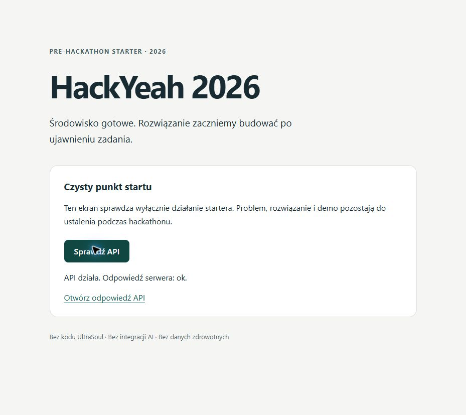

# Verification

## Current phase 1 — 2026-10-03

Live demo: https://cukier-w-biegu.vercel.app.
See [PHASE_1_REVIEW.md](PHASE_1_REVIEW.md) for executed checks, runtime screenshots,
31 passing Python tests, final deployment and the native print-preview verification limit.

## Archived starter verification — 2026-10-01

This verifies pre-event preparation only. It is not evidence of a SPORT & HEALTHCARE
solution, live LLM integration, deployed demo or competition eligibility.

## Environment

- Windows, Node.js `v24.21.0`, npm `11.19.0`.
- Source: the initial starter files staged in Git, exported using
  `git checkout-index --all --prefix=.verification/clean/`.
- The export began without `node_modules`, `.next`, `next-env.d.ts` or `.env.local`.
- Clean export location: `C:/hackyeah-2026/.verification/clean` (ignored).
- Direct package versions were confirmed with `npm ls --depth=0`.

## Clean install

Command: `npm ci` in the clean export. Exit **0**.

```text
added 354 packages, and audited 355 packages in 15s
found 0 vulnerabilities
```

npm emitted an ESLint 9 support/deprecation warning and an unapproved install-script
notice for `unrs-resolver`. No script approval or security setting was changed;
the subsequent build and lint checks passed without it.

## Build, types and lint

Commands: `npm run build`, then `npm run check`. Both exit **0** on the final config.

```text
▲ Next.js 16.3.8 (Turbopack)
✓ Compiled successfully in 3.3s
Running TypeScript ...
Finished TypeScript in 1780ms ...
✓ Generating static pages using 5 workers (3/3) in 1953ms

Route (app)
┌ ○ /
├ ○ /_not-found
└ ƒ /api/health

> hackyeah-2026@0.0.0 check
> npm run typecheck && npm run lint
> hackyeah-2026@0.0.0 typecheck
> tsc --noEmit
> hackyeah-2026@0.0.0 lint
> eslint . --max-warnings 0
```

## Runtime checks

Development command: `npm run dev` in the original checkout, serving port 3000.

```text
▲ Next.js 16.3.8 (Turbopack)
Local: http://127.0.0.1:3000
✓ Ready in 405ms
```

Production: the clean export's local Next.js CLI, invoked with the same `start`
arguments as `npm start`, on port 3011 to avoid the dev server's port.

```text
▲ Next.js 16.3.8
Local: http://127.0.0.1:3011
✓ Ready in 169ms
PRODUCTION HEALTH HTTP: 200
{"status":"ok","service":"hackyeah-2026","phase":"pre-hackathon-starter"}
PRODUCTION HOME HTTP: 200
RESPONSE ASSERTIONS: PASS
```

PowerShell `Invoke-WebRequest` assertions checked HTTP 200 and all three health
fields, then HTTP 200 and the heading/button markers in the page. A separate
`curl.exe --fail --silent http://127.0.0.1:3000/api/health` returned the same JSON
from the development server.

Chrome verification on both servers: load the page, click **Sprawdź API**, wait for
the rendered status and inspect the screenshot. The clean production page rendered:

```text
API działa. Odpowiedź serwera: ok.
```



## Compatibility issue resolved during preparation

ESLint 10.11.0 failed in Next.js's `eslint-plugin-react` with
`contextOrFilename.getFilename is not a function`. Pinning 9.39.5 resolved the failure;
the tradeoff is recorded in `DECISIONS.md`. An early build run before installation
finished picked up a parent-directory Next.js 15 executable; it is excluded from
the evidence above. All accepted checks used the local, pinned Next.js 16.3.8.

No automated regression test suite was introduced for this small neutral starter.
The real health response and rendered result were checked directly.

## Phase 2

Actual FIT/Dexcom import and optional Anthropic analysis are implemented separately
from the historical phase-1 UI. Current executed checks and live status:
[PHASE_2_REVIEW.md](PHASE_2_REVIEW.md). Artifact provenance:
[phase-2-deployment.json](phase-2-deployment.json).
